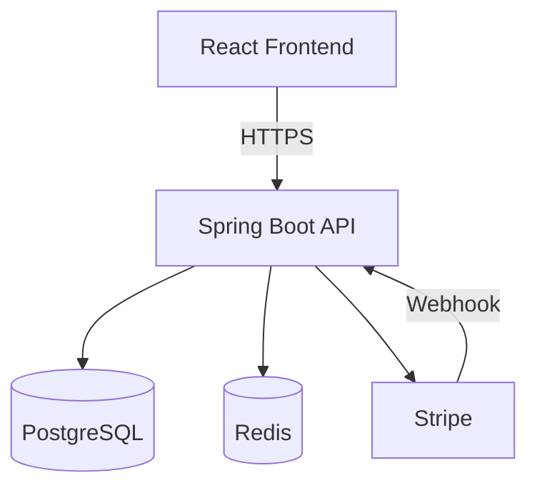
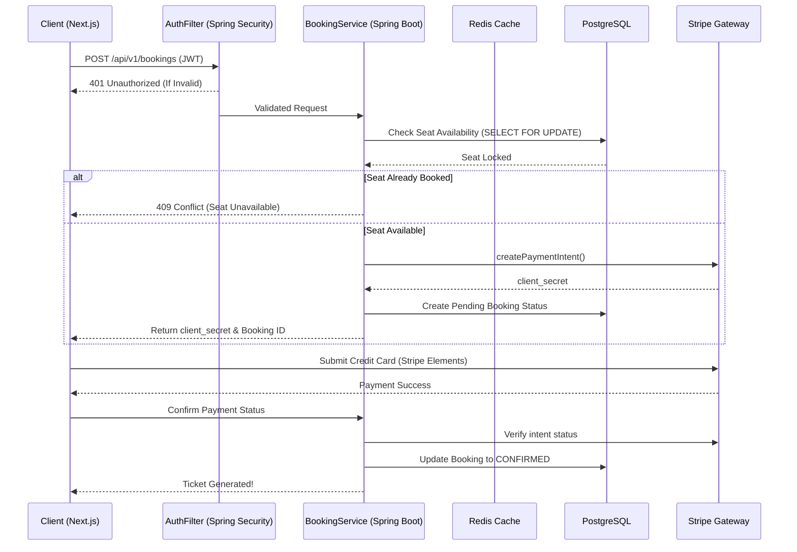

# 🎬 Screenly - Full Stack Movie Ticket Booking Platform

Hi there! 👋 Welcome to **Screenly** — a modern, end-to-end movie ticket booking platform that I built to solve the classic "double booking" problem during high-traffic flash sales. 

I designed this project from the ground up to showcase a complete, production-ready full stack architecture. It combines a highly responsive **Next.js / React** frontend with a robust, scalable **Java Spring Boot** backend, communicating via RESTful APIs.

---

## 🛠️ Tech Stack & Skills Highlighted

If you're looking for specific technologies, here's a quick rundown of the stack I used:

* **Frontend:** React, Next.js 14 (App Router), TypeScript, Tailwind CSS, Framer Motion, Zustand (State Management), React Query (Data Fetching).
* **Backend:** Java 17+, Spring Boot 3, Spring Security (JWT Auth), Spring Data JPA (Hibernate).
* **Database & Caching:** PostgreSQL (Relational DB, ACID Transactions), Redis (Session / Cache).
* **Integrations:** Stripe Payment Gateway (Elements API), OMDB API.
* **Architecture & Patterns:** REST API Design, Strategy Pattern, SOLID Principles, Row-Level Database Locking, Microservices-ready structure, Docker Containerization.

---

## 🏗️ System Design & Request Flow

The most interesting technical challenge of this project was handling **high concurrency**. Imagine 100 users trying to click the exact same seat for a blockbuster movie premiere at the same time. 

Here is how I designed the architecture to handle it gracefully:

1. **Client Tier (Next.js):** Aggressively caches the movie catalog and theater layouts using React Query, preventing unnecessary network trips to the backend.
2. **API Gateway / Auth:** Incoming requests hit the Spring Boot API where stateless JWT tokens are verified by Spring Security filters.
3. **Caching Layer (Redis):** Short-lived data, like OTPs (One-Time Passwords) for authentication, are stored in Redis for lightning-fast lookups.
4. **Persistent Storage & Concurrency (PostgreSQL):** When a user attempts to book a seat, the system executes an explicit row-level lock (`SELECT ... FOR UPDATE`). This guarantees strict serialization at the database level. The first request succeeds, and subsequent simultaneous requests instantly receive a graceful `409 Conflict` (Seat Unavailable) instead of corrupting the database.

### 🏛️ Architecture Topology



### 🔁 Booking Sequence Flow



---

## 🧠 Coding Practices & Philosophy

* **Clean Code & Strategy Pattern:** I heavily utilized the Strategy Pattern (via a `PaymentProviderFactory`). If the business suddenly wants to switch from Stripe to Google Pay or Amazon Pay, I can just drop in a new class implementing the `PaymentProvider` interface without touching the core booking logic. 
* **Fail-Fast Logic:** I prefer guard clauses over deep `if/else` nesting. This makes the code much easier for other developers to read and maintain.
* **Global Error Handling:** I implemented global exception handlers (`@ControllerAdvice` on the backend, Axios Interceptors on the frontend) so that domain exceptions always map to standardized, predictable HTTP responses and UI toast notifications.

---

## 🚀 How to Run Locally

If you want to spin this up on your own machine, you just need Java 17+, Node.js 18+, and a local PostgreSQL instance.

### 1. Backend Setup
```bash
# Update src/main/resources/application.yml with your DB credentials first!
mvn clean install
mvn spring-boot:run
```
*(Runs on http://localhost:8080)*

### 2. Frontend Setup
```bash
# Create a .env.local file with NEXT_PUBLIC_API_URL=http://localhost:8080/api/v1
npm install
npm run dev
```
*(Runs on http://localhost:3000)*
